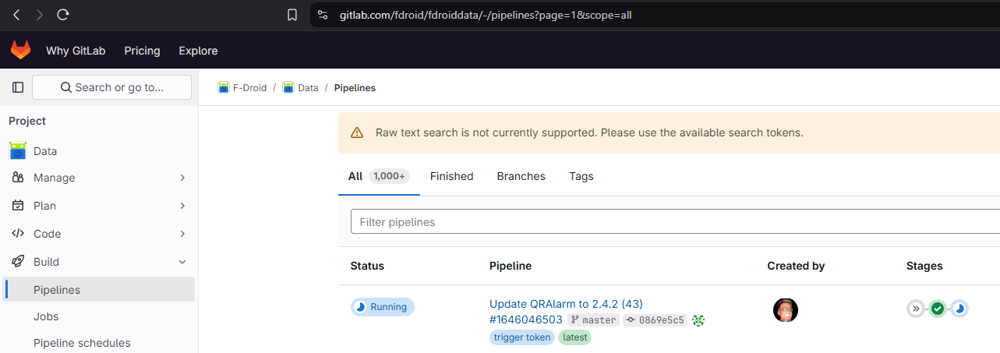
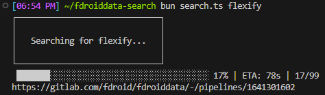

# Fdroid Data Search

Raw text searching for Fdroiddata pipelines is disabled.



This script searches through them using the Gitlab API.



# Usage

```sh
git clone https://github.com/brandonp2412/F-droid-data-search fdroiddata-search
cd fdroiddata-search
bun install
bun search.ts flexify
```

# Optional args

Pass limit to go beyond 99 pages of the pipelines:

```sh
bun search.ts Notally 999
```
